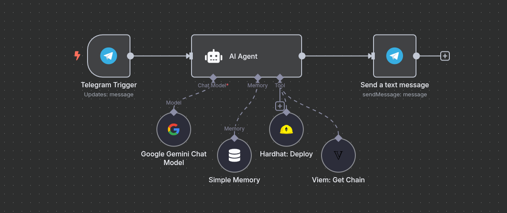

# 🤖 Deploy Telegram Bot Tutorial

## Overview

This tutorial shows how to build a simple but powerful Telegram bot using **n8n**, **AI Agent**, and **n3XUS** blockchain nodes. The bot will be able to chat with users and execute blockchain operations when needed.



## What You'll Build

A Telegram bot that can:

- 💬 Chat naturally with users using AI
- 🔗 Get blockchain information (chain details)
- 🚀 Deploy smart contracts on command
- 🧠 Remember conversation context

## Prerequisites

- n8n installed and running
- n3XUS nodes package installed
- Telegram Bot Token (from [@BotFather](https://t.me/botfather))
- Google Gemini API key
- Ethereum wallet with testnet funds

## Step 1: Setup

### 1.1 Create Telegram Bot

1. Open Telegram and search for [@BotFather](https://t.me/botfather)
2. Send `/newbot` command
3. Follow prompts to create your bot
4. Save the **Bot Token**

### 1.2 Get Google Gemini API Key

1. Go to [Google AI Studio](https://aistudio.google.com/)
2. Create an API key
3. Save the key for later

### 1.3 Start n8n

```bash
n8n start
```

Navigate to `http://localhost:5678`

## Step 2: Configure Credentials

### 2.1 Add Telegram Credentials

1. Go to **Settings** → **Credentials**
2. Add **Telegram** credential
3. Enter your Bot Token

### 2.2 Add Google Gemini Credentials

1. Add **Google Gemini** credential
2. Enter your API key

### 2.3 Add Blockchain Credentials

1. Add **Viem Credentials**:
   - Private Key: Your wallet's private key
   - RPC URL: (optional)

## Step 3: Build the Workflow

### 3.1 Create New Workflow

1. Click **Add workflow**
2. Name it "AI Telegram Bot"

### 3.2 Add Main Flow

#### Telegram Trigger

1. Add **Telegram Trigger** node
2. Configure:
   - **Credential**: Select your Telegram credential
   - **Updates**: `message`

#### AI Agent

1. Add **AI Agent** node
2. Configure:
   - **Chat Model**: Connect to Google Gemini
   - **Memory**: Connect to Simple Memory
   - **Tools**: Connect blockchain tools

#### Send Response

1. Add **Telegram** node (send message)
2. Configure:
   - **Chat ID**: `{{$json.chatId}}`
   - **Text**: `{{$json.output}}`

### 3.3 Add Supporting Nodes

#### Google Gemini Chat Model

1. Add **Google Gemini Chat Model** node
2. Configure:
   - **Credential**: Select your Google credential
   - **Model**: `gemini-pro`

#### Simple Memory

1. Add **Simple Memory** node
2. This will store conversation context

#### Hardhat: Deploy (Tool)

1. Add **Hardhat: Deploy** node
2. Configure as a tool for the AI Agent:
   - **Contract Code**: Will be provided by AI
   - **Chain ID**: Also will be provided by AI

#### Viem: Get Chain (Tool)

1. Add **Viem: Get Chain** node
2. Configure as a tool:
   - **Chain ID**: Will be provided by AI

## Step 4: Configure AI Agent

### 4.1 System Prompt

```
You are a helpful blockchain assistant bot. You can:

1. Chat naturally with users
2. Get blockchain information using the "Get Chain" tool
3. Deploy smart contracts using the "Deploy Contract" tool

When users ask about blockchain networks, use the Get Chain tool.
When users want to deploy a contract, use the Deploy Contract tool.

Always be helpful and explain what you're doing.
```

### 4.2 Tool Configuration

Connect the tools to AI Agent:

- **Hardhat: Deploy** → Available as "Deploy Contract"
- **Viem: Get Chain** → Available as "Get Chain Info"

## Step 5: Test Your Bot

### 5.1 Start the Workflow

1. Activate your workflow
2. It will start listening for Telegram messages

### 5.2 Test Commands

Send these messages to your bot:

```
User: Hello!
Bot: Hi! I'm your blockchain assistant. I can help you with blockchain info and deploy contracts. What would you like to do?

User: What is chain ID 1?
Bot: Let me check that for you... [uses Get Chain tool]
     Chain ID 1 is Ethereum Mainnet with native currency ETH.

User: Deploy a simple storage contract
Bot: I'll deploy a simple storage contract for you... [uses Deploy Contract tool]
     ✅ Contract deployed successfully!
     Address: 0x123...
     Transaction: 0xabc...
```

## Step 6: Example Conversations

### Getting Chain Information

```
User: Tell me about Sepolia testnet
Bot: [AI Agent uses Viem: Get Chain tool]
     Sepolia is Ethereum's test network (Chain ID: 11155111).
     It uses SepoliaETH as native currency and is perfect for testing!
```

### Deploying Contracts

```
User: I want to deploy a simple counter contract
Bot: [AI Agent uses Hardhat: Deploy tool with generated contract code]
     ✅ Counter contract deployed!
     📍 Address: 0x742d35Cc6634C0532925a3b8D3Ac8c34a4482FB2
     🔗 Transaction: 0x1234...
     ⛽ Gas Used: 145,230
```

## Step 7 (optional): Customization

### 7.1 Add More Tools

You can connect more n3XUS nodes as tools:

- **Aave: Status** → Check DeFi positions
- **The Graph: View Wallet Balances** → Check wallet balances
- **ENS: Get Address from ENS** → Resolve ENS domains

### 7.2 Improve AI Responses

Modify the system prompt to:

- Add personality to your bot
- Include specific instructions
- Add safety warnings for financial operations

### 7.3 Add Error Handling

Add **IF** nodes to handle:

- Invalid addresses
- Network errors
- Insufficient funds

## Troubleshooting

### Common Issues

1. **Bot not responding**: Check Telegram credentials
2. **AI not working**: Verify Google Gemini API key
3. **Tools not executing**: Check blockchain credentials
4. **Memory issues**: Restart the workflow

### Debug Tips

1. Check execution logs in n8n
2. Test tools individually
3. Verify API keys are correct
4. Use testnet for blockchain operations

## Security Notes

⚠️ **Important Security Warnings:**

- Never share your private keys
- Use testnet for development
- Validate all user inputs
- Monitor gas usage
- Set spending limits

## Conclusion

You've built a smart Telegram bot that can:

- Chat naturally using AI
- Execute blockchain operations
- Remember conversation context
- Deploy smart contracts
- Provide blockchain information

The bot combines the power of AI with blockchain functionality, making Web3 accessible through simple chat commands!

## Next Steps

- Add more blockchain tools
- Implement user authentication
- Add transaction monitoring
- Create custom contract templates
- Build multi-chain support

## Resources

- [n8n Documentation](https://docs.n8n.io/)
- [Google Gemini API](https://ai.google.dev/)
- [Telegram Bot API](https://core.telegram.org/bots/api)
- [n3XUS Nodes](../../README.md)

---

**Happy Building! 🚀**

_For support and questions, join our community or open an issue on GitHub._
